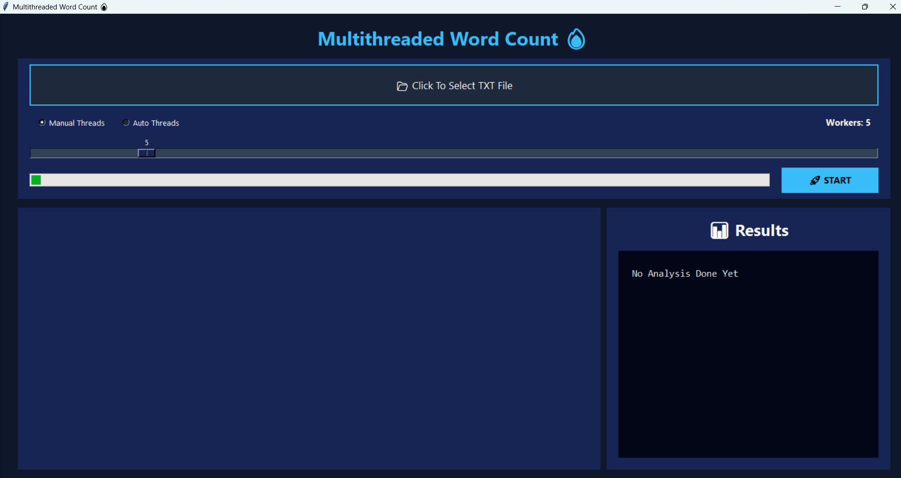
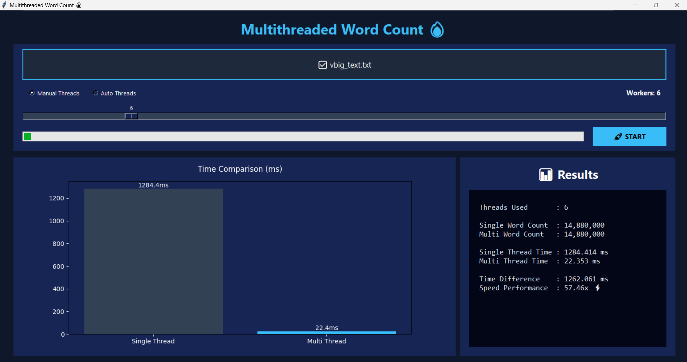

# Multithreaded Word Counter 

Python GUI application for multithreaded word counting using MVC architecture, Strategy Pattern, and Producer-Consumer synchronization.

---

## Project Overview

This project demonstrates parallel programming concepts using multithreading in Python.

The application reads a text file, divides it into smaller chunks, and processes each chunk using multiple threads to count words efficiently. It also compares the execution time between single-threaded and multithreaded approaches.

The project follows clean software architecture principles and includes real-time visualization using a graphical user interface.

---

## Features

- Multithreaded word counting
- Single-thread vs Multithread comparison
- Producer–Consumer synchronization
- Queue-based thread communication
- MVC Architecture Pattern
- Strategy Design Pattern
- Interactive GUI using Tkinter
- Performance visualization using Matplotlib

---

## Technologies Used

- Python
- Tkinter
- Threading
- Queue
- Matplotlib
- Object-Oriented Programming (OOP)

---

## Architecture & Design Patterns

### MVC Architecture
- Model → `WordCounterModel`
- View → `AppView`
- Controller → `Controller`

### Strategy Pattern
- `ManualThreadStrategy`
- `AutoThreadStrategy`

### Producer–Consumer Pattern
Implemented using:
- Queue
- Threads
- Synchronization Lock

---

## How It Works

1. The application reads a text file.
2. The text is split into multiple chunks.
3. Each chunk is assigned to a separate worker thread.
4. Threads process chunks concurrently.
5. Word counts are collected and combined.
6. Execution times are compared and visualized.

---

## Project Structure

```text
multithreaded-word-counter/
│
├── main.py
├── README.md
├── requirements.txt
├── .gitignore
│
├── data/
│   └── sample.txt
│
└── screenshots/
    ├── home.png
    ├── manual-result.png
    └── auto-result.png
```

---

## How To Run

```bash
pip install -r requirements.txt
python main.py
```

---

## Screenshots

### Home Interface


### Manual Thread Mode


### Auto Thread Mode


---

## Future Improvements

- Add multiprocessing support
- Real-time thread monitoring
- Export results to CSV
- Enhanced statistics visualization

---

## Author

Developed as a Parallel Programming course project.
